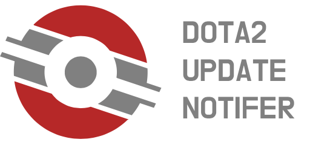

  

Hello! In 2019, the dota2.com website switched to clean-html, which means that it was no longer possible to scrape data from the site using popular libraries like Beautiful Soup, SwiftSoup, and similar ones. This led to the closure of all projects that collected data on Dota 2 updates and provided them in a convenient format on other resources. This application is a revival. Now you can not only view the list of changes but also receive notifications about events, new patches, and other Dota 2 updates. You can also install a widget.

### **Progect link:** ---

## **In the project, i use:**
- Swift

